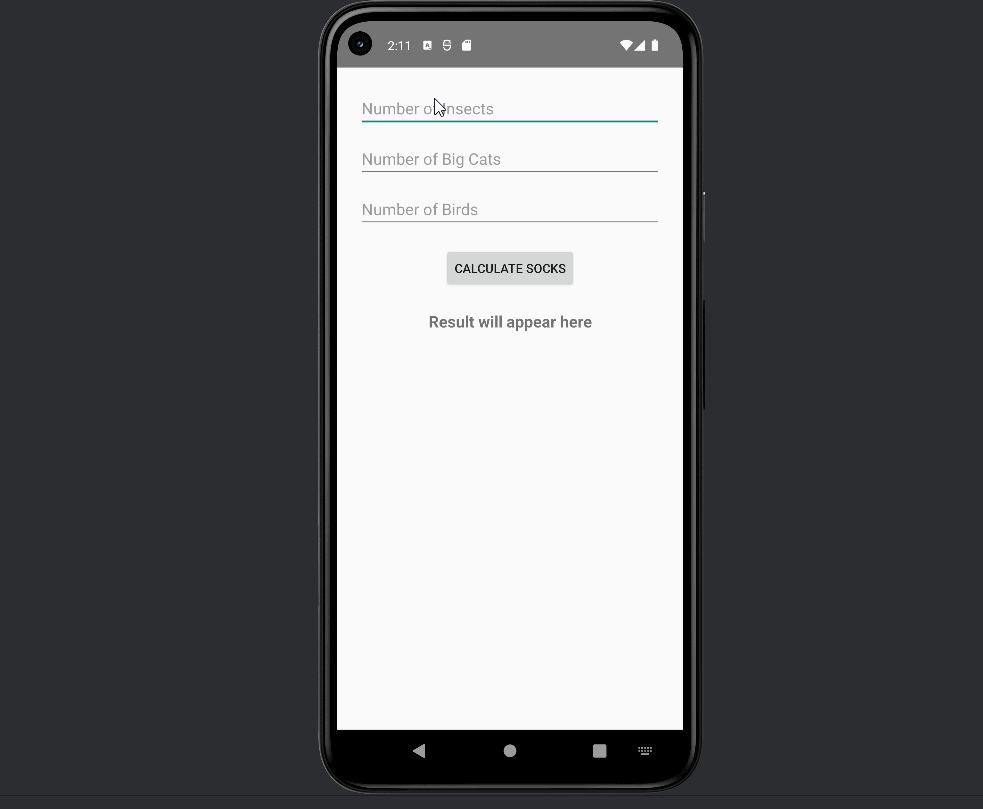

# AND101 Project 4 - CodeMath

Submitted by: **Rahat Moktadir**

Time spent: **5** hours spent in total

## Summary

**Animal Sock Calculator** is an Android app that calculates the number of socks needed to keep all animals in a zoo warm based on how many insects, big cats, and birds the user inputs. It also estimates the total cost of socks based on the number of legs.

If I had to describe this project in three (3) emojis, they would be: 🐾🧦🧮

## Application Features

The following REQUIRED features are completed:

- [x] At least one (1) user input
- [x] At least one (1) interactive View
- [x] At least one (1) output of a calculation based on the user input

The following STRETCH features are implemented:

- [x] Implement ViewBinding to reduce boilerplate code and increase efficiency
- [x] Add at least one (1) additional functionality  
  (💡 Calculated total **sock cost** using price-per-sock logic)

The following EXTRA features are implemented:

- [x] Default inputs to 0 if user leaves any field blank
- [x] Clear, multi-line result formatting with total legs and cost breakdown
- [x] Input validation using `toIntOrNull()` for crash prevention

## Video Demo

Here's a video / GIF that demos all of the app's implemented features:

GIF created with **ScreenToGif**

## Notes

I had a blast working on this project — this was my first time converting a Jetpack Compose starter project to use traditional XML layouts and ViewBinding. I ran into some theme compatibility issues (Theme.AppCompat vs. Material3) but learned how to properly update `themes.xml` to support AppCompat widgets. That experience really helped me understand how the Android view system and theming works under the hood.

## License

Copyright 2025 **Rahat Moktadir**

Licensed under the Apache License, Version 2.0 (the "License");  
you may not use this file except in compliance with the License.  
You may obtain a copy of the License at

    http://www.apache.org/licenses/LICENSE-2.0

Unless required by applicable law or agreed to in writing, software  
distributed under the License is distributed on an "AS IS" BASIS,  
WITHOUT WARRANTIES OR CONDITIONS OF ANY KIND, either express or implied.  
See the License for the specific language governing permissions and  
limitations under the License.
